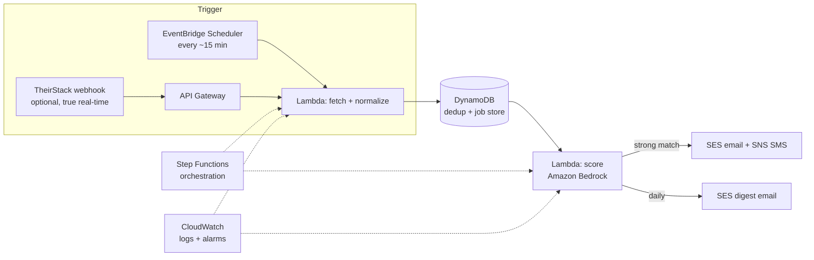

# aws-job-streamer

> A serverless, event-driven AWS pipeline that ingests job postings from multiple sources,
> LLM-scores each one against a target profile with Amazon Bedrock, filters out ghost/stale
> listings, and delivers **near-real-time** email + text alerts for strong matches — plus a
> ranked daily digest.

> 🚧 **Building in public.** This repo is under active development — see the [Roadmap](#roadmap).

---

## Why

Job hunting is a data problem: postings are scattered across dozens of boards, many are stale or
"ghost" jobs, and the good ones fill fast. `aws-job-streamer` treats the job search as a data
pipeline — pull from clean sources, score every role against *your* profile with an LLM, drop the
noise, and alert you the moment a real match appears.

It's also a working demonstration of a modern **serverless AWS + Terraform + Bedrock** stack.

## What it does

- **Ingests** jobs from clean, ToS-safe sources (public ATS APIs: Greenhouse, Lever, Ashby,
  Workable, + aggregators like Adzuna). No scraping of sites that ban it.
- **Dedupes** so you never see the same posting twice.
- **Scores** each new role 0–100 against a configurable profile using **Amazon Bedrock**, with a
  short reason and auto-skip flags (e.g. hard requirements you don't meet).
- **Filters ghost/stale jobs** using detectable red-flags (posting age, missing salary, vague
  evergreen reqs) plus a first-seen cross-check.
- **Alerts** near-real-time via **SES** (email) and **SNS** (SMS) on strong matches, and sends a
  ranked **daily digest**.
- **Human-in-the-loop** — it surfaces and drafts, you decide and apply. No blind auto-applying.

## Architecture

## Tech stack

| Layer | Choice |
|---|---|
| Language | Python 3.13 (uv, ruff, pytest) |
| Infrastructure as Code | Terraform |
| Compute | AWS Lambda |
| Orchestration | AWS Step Functions |
| Scheduling | Amazon EventBridge Scheduler |
| Data store | Amazon DynamoDB |
| LLM scoring | Amazon Bedrock |
| Notifications | Amazon SES (email) + SNS (SMS) |
| Webhook ingress | Amazon API Gateway |
| Secrets | AWS SSM Parameter Store |
| Observability | Amazon CloudWatch |
| CI/CD | GitHub Actions |

## Design principles

- **ToS-safe sources only** — public ATS APIs + licensed aggregators. No scraping boards that ban it.
- **Cost-aware** — serverless + free-tier friendly; scores only *new* jobs so most runs cost ~nothing.
- **Ghost-job aware** — actively filters stale/reposted listings rather than trusting "posted" dates.
- **Human-in-the-loop** — assists the search; never applies on your behalf.

## Roadmap

- [ ] **Phase 1** — Source fetchers + dedup + local MVP (see real jobs in the terminal)
- [ ] **Phase 2** — LLM fit-scoring against a profile + ghost-job filter (Amazon Bedrock)
- [ ] **Phase 3** — Email digest + instant match alerts (SES / SNS)
- [ ] **Phase 4** — Deploy to serverless AWS (Lambda, Step Functions, EventBridge, DynamoDB) via Terraform
- [ ] **Phase 5** — CI/CD (GitHub Actions), observability, docs

## Getting started

_Coming soon — setup and deploy instructions land as Phase 1–4 ship._

## License

MIT — see [LICENSE](LICENSE).
