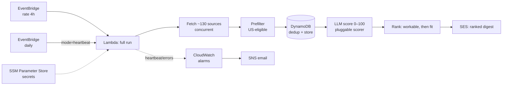

# aws-job-streamer

> A serverless AWS pipeline that pulls jobs from ~130 sources every few hours, LLM-scores each new
> one against a target profile, keeps only the roles you could actually take, and emails a ranked
> digest — plus a daily "still alive" summary and CloudWatch alarms so it's never silently broken.

**It's live.** A scheduled Lambda runs the whole pipeline every 4 hours and has emailed real,
workable matches from every source family. This repo is the production code, not a spec.

---

## Why

Job hunting is a data problem: postings are scattered across dozens of boards, many are stale, and
the good ones fill fast. `aws-job-streamer` treats the search as a data pipeline — pull from clean
sources, score every new role against *your* profile with an LLM, drop everything you couldn't take,
and email only the matches worth your time.

It's also a working demonstration of a modern **serverless AWS + Terraform** stack, built the slow,
senior way: probe every API before writing a fetcher, test-first, and write down the decisions.

## What it does

- **Ingests** from ~130 boards across clean, ToS-safe sources — public ATS APIs (Greenhouse, Lever,
  Ashby), per-tenant **Workday** boards, plus **Adzuna** (geocoded local search), **Remotive**
  (remote-only), and **USAJobs** (federal). Fetched concurrently — all sources in ~17s.
- **Prefilters** for US work-eligibility before spending a cent on scoring (drops clearly-foreign
  postings; handles traps like Workday's `CA-Ontario` meaning Canada, not California).
- **Dedupes** in DynamoDB so every posting is scored — and paid for — exactly once, ever.
- **Scores** each new role 0–100 against a configurable profile with an LLM, returning a short
  reason and skip-flags. The scorer is behind a clean boundary (see *LLM scoring* below).
- **Ranks by workability, then fit** — a location tier (remote → target-metro → onsite-you-won't-
  relocate-to) filters out roles you couldn't take, so a great job in the wrong city can't crowd out
  a workable one.
- **Emails** a ranked digest (with a spend-transparency line), a **daily heartbeat** summary so
  silence never reads as "is it broken?", and fires **CloudWatch alarms** if it actually breaks.
- **Human-in-the-loop** — it surfaces and ranks; you decide and apply. No blind auto-applying.

## Architecture

## Tech stack

| Layer | Choice |
|---|---|
| Language | Python 3.13 (uv, ruff, ty, pytest) |
| Infrastructure as Code | Terraform |
| Compute | AWS Lambda (single-function pipeline) |
| Scheduling | Amazon EventBridge (`rate(4 hours)` + daily heartbeat) |
| Data store | Amazon DynamoDB (dedup + job store) |
| LLM scoring | Pluggable scorer — OpenRouter (Claude Haiku 4.5) today; **Amazon Bedrock migration in progress** (see Roadmap) |
| Notifications | Amazon SES (digest + heartbeat email) |
| Observability | Amazon CloudWatch (alarms) + SNS (alert email) |
| Secrets | AWS SSM Parameter Store (SecureString) |

## Design principles

- **ToS-safe sources only** — public ATS APIs + licensed aggregators. No scraping boards that ban it.
- **Probe before you build** — every source's live API is exercised by hand before a fetcher is
  written. A 200 with an empty body is a 404 in disguise; catching that up front saved real bugs.
- **Pay once, ever** — dedup means a posting is scored a single time across the app's whole life;
  cold-start guards (freshness cut + per-run cap) keep the LLM bill bounded and predictable.
- **Workable-first** — a job you can't take can't top the digest, no matter how well it scores.
- **Fail loud, never silent** — a hard failure raises (CloudWatch Errors alarm); a degraded run logs
  a WARN/ERROR heartbeat; a quiet day still sends the daily summary. Silence is always real silence.

## Engineering notes

A few things this project got right the hard way, written up in the code and `PLAN.md`:

- **The cron incident.** Enabling the schedule with a *sequential* fetch of 128 sources blew the
  Lambda timeout, which triggered a retry and a double run. Fix: a concurrent fetch
  (`ThreadPoolExecutor`) that does all sources in ~17s, plus workable-only scoring to cut volume.
- **Measure, don't guess, cost.** The first cost estimate was 4× too low. Measuring real per-job
  spend drove the switch to a cheaper model, validated on a gold set of real applications first.
- **Test-first.** 616 tests; fetchers are split into a pure `parse_*` half and a thin IO shell so the
  parsing logic is fully unit-tested without a network.

## Roadmap

- [x] **Phase 1** — Source fetchers + dedup + local MVP (real jobs in the terminal)
- [x] **Phase 2** — LLM fit-scoring against a profile + US-eligibility prefilter
- [x] **Phase 3** — Ranked email digest + daily heartbeat summary
- [x] **Phase 4** — Deployed to serverless AWS (Lambda, EventBridge, DynamoDB, SES, CloudWatch) via Terraform
- [ ] **Phase 5** — CI/CD (GitHub Actions), fuller docs, and the **Bedrock migration** (swap the scorer from OpenRouter to Amazon Bedrock behind the existing boundary — same model, AWS-native auth; pending a quota grant)

## License

MIT — see [LICENSE](LICENSE).
